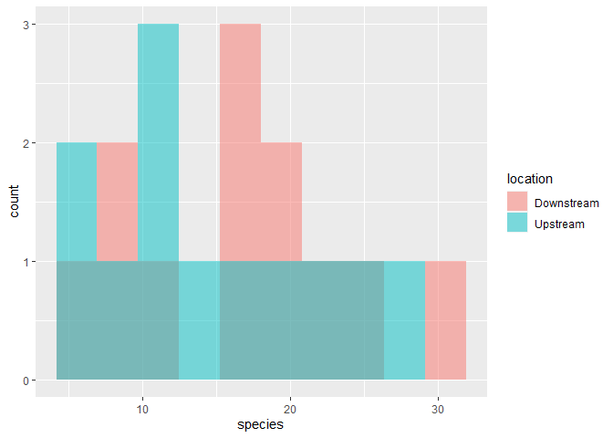
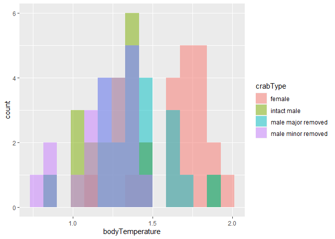

Lab 6 Comparing two means
================
Brett Vetter

Researchers studying the number of electric fish species living in
various parts of the Amazon basin were interested in whether the
presence of tributaries affected the local number of electric fish
species in the main rivers (Fernandes et al. 2004).

They counted the number of electric fish species above and below the
entrance point of a major tributary at 12 different river locations.

The data is provided in your GitHub repository.

For each question below, write a sentence answering the question and
show the code you used to come up with the answer, if applicable.

``` r
library(tidyverse)
```

    ## -- Attaching packages --------------------------------------- tidyverse 1.3.0 --

    ## v ggplot2 3.3.3     v purrr   0.3.4
    ## v tibble  3.0.4     v dplyr   1.0.2
    ## v tidyr   1.1.2     v stringr 1.4.0
    ## v readr   1.4.0     v forcats 0.5.0

    ## -- Conflicts ------------------------------------------ tidyverse_conflicts() --
    ## x dplyr::filter() masks stats::filter()
    ## x dplyr::lag()    masks stats::lag()

``` r
fish <- read_csv("chap12q19ElectricFish.csv")
```

    ## 
    ## -- Column specification --------------------------------------------------------
    ## cols(
    ##   tributary = col_character(),
    ##   speciesUpstream = col_double(),
    ##   speciesDownstream = col_double()
    ## )

``` r
fish_long <-
  pivot_longer(fish, speciesUpstream:speciesDownstream,
               names_to = "location",
               values_to = "species") %>%
  mutate(location = str_remove(location, c("species"))) %>%
  print()
```

    ## # A tibble: 24 x 3
    ##    tributary location   species
    ##    <chr>     <chr>        <dbl>
    ##  1 Içá       Upstream        14
    ##  2 Içá       Downstream      19
    ##  3 Jutaí     Upstream        11
    ##  4 Jutaí     Downstream      18
    ##  5 Japurá    Upstream         8
    ##  6 Japurá    Downstream       8
    ##  7 Coari     Upstream         5
    ##  8 Coari     Downstream       7
    ##  9 Purus     Upstream        10
    ## 10 Purus     Downstream      16
    ## # ... with 14 more rows

``` r
crab <- read_csv("chap15q27FiddlerCrabFans.csv")
```

    ## 
    ## -- Column specification --------------------------------------------------------
    ## cols(
    ##   crabType = col_character(),
    ##   bodyTemperature = col_double()
    ## )

## Question A

> What is the mean different in the number of species between areas
> upstream and downstream of a tributary? What is the 95% confidence
> interval of this mean difference. Show your code and write a sentence
> giving your answer

ANSWER

``` r
t.test(formula = species ~ location, data = fish_long)
```

    ## 
    ##  Welch Two Sample t-test
    ## 
    ## data:  species by location
    ## t = 0.59249, df = 21.81, p-value = 0.5596
    ## alternative hypothesis: true difference in means is not equal to 0
    ## 95 percent confidence interval:
    ##  -4.587031  8.253697
    ## sample estimates:
    ## mean in group Downstream   mean in group Upstream 
    ##                 16.41667                 14.58333

The mean difference in species between upstream and downstream areas is
1.84 species, and the 95% confidence interval for the means is (-4.58
8.25).

## Question B

> Test the hypothesis that the tributaries have no effect on the number
> of species of electric fish.

ANSWER

From the T test we conducted we determined that we can reject the null
hypothesis that the location has no effect on the number of species of
electric fish. There was a significant difference in number of species
between locations.

## Question C

> State the assumptions that you had to make to complete parts (A) and
> (B). Create a graph to assess whether one of those assumptions was
> met.

ANSWER

``` r
fish_long %>% 
  ggplot(aes(x = species)) +
  geom_histogram(
    aes(fill = location), 
    bins = 10, 
    alpha = 0.5, 
    position = "identity"
  ) 
```

<!-- -->

My assumption for part A is that there IS a difference between the
number of species in the two different locations (upstream, downstream).
This would be the alternative hypothesis and it is the same as saying
the difference in means is not equal to 0. My assumption for part B is
that there is NO difference in the number of species in each location.
This would be the Null hypothesis and it is the same as saying the
difference in means is equal to 0. The histogram I created shows how the
assumption from Part A was met.

## ANOVA

Fiddler crabs are so called because males have a greatly enlarged
“major” claw, which is used to attract females and to defend a
burrow.

Darnell and Munguia (2011) recently suggested that this appendage might
also act as a heat sink, keeping males cooler while out of the burrow on
hot days.

To test this, they placed four groups of crabs into separate plastic
cups and supplied a source of radiant heat (60-watt light bulb) from
above. The four groups were intact male crabs, male crabs with the major
claw removed; male crabs with the other (minor) claw removed (control);
and intact female fiddler crabs.

They measured the body temperature of crabs every 10 minutes for 1.5
hours. These measurements were used to calculate a rate of heat gain for
every individual crab in degrees C/log minute. Rates of heat gain for
all crabs are provided in the accompanying data file.

### Question D

Graph the distribution of body temperatures for each crab type:

``` r
crab %>% 
  ggplot(aes(x = bodyTemperature )) +
  geom_histogram(
    aes(fill = crabType), 
    bins = 15, 
    alpha = 0.5, 
    position = "identity",
    na.rm = TRUE
  ) 
```

<!-- -->

### Question E

Does body temperature varies among crab types? State the null and
alternative hypothesis, conduct and ANOVA, and interpret the results.

``` r
aov_crabs <-
  aov(bodyTemperature ~ crabType, data = crab)
aov_crabs 
```

    ## Call:
    ##    aov(formula = bodyTemperature ~ crabType, data = crab)
    ## 
    ## Terms:
    ##                 crabType Residuals
    ## Sum of Squares  2.641310  3.467619
    ## Deg. of Freedom        3        80
    ## 
    ## Residual standard error: 0.2081952
    ## Estimated effects may be unbalanced
    ## 1 observation deleted due to missingness

``` r
summary(aov_crabs)
```

    ##             Df Sum Sq Mean Sq F value Pr(>F)    
    ## crabType     3  2.641  0.8804   20.31  7e-10 ***
    ## Residuals   80  3.468  0.0433                   
    ## ---
    ## Signif. codes:  0 '***' 0.001 '**' 0.01 '*' 0.05 '.' 0.1 ' ' 1
    ## 1 observation deleted due to missingness

The The null hypothesis is that the body temp does not vary at all
between the crab types. The alternative hypothesis is that at least one
crab type varies in body temp compared to the other types. Because the p
value is less than 0.05 we can reject the null, and because under the
alternative hypothesis F would be greater than 1 and the F was much
greater than 1, this tells us that body temp in at least one crab type
does significantly vary.
